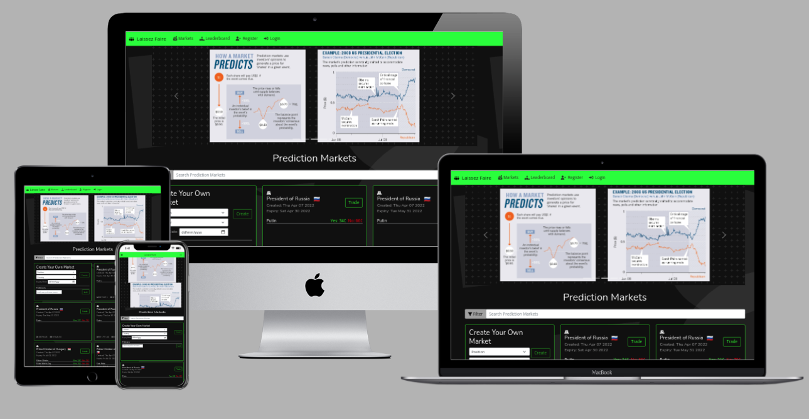
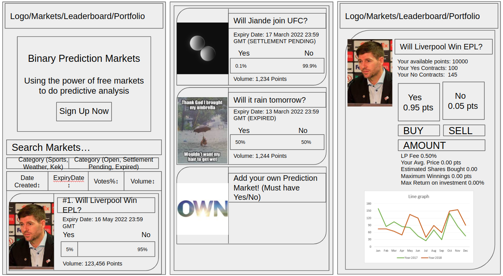
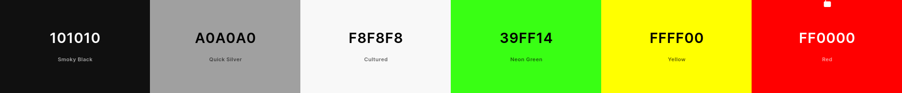

# TGC-16 Project 2

# Title: Laissez Faire

### (French) "let people do as they choose"

## URL to deployed app
https://zesty-licorice-7fe033.netlify.app/

## Summary

### Binary Prediction Markets Funding Political Investigative Reporting

Prediction markets are exchange-traded markets created for the purpose to trade the outcome of events. The market prices can indicate what the crowd thinks the probability of that event happening is. This is a way of retrieving reliable crowd-sourced predictions. In fact, in 1996, one such prediction market managed to predict 32/39 Oscar nominees and 7/8 winners.

My project is an beta implementation of prediction markets for the purpose of funding investigative reporting inspired by [Hindenburg Research.](https://astralcodexten.substack.com/p/use-prediction-markets-to-fund-investigative?s=r) Investigative journalists rarely capture any of the value they add to society by weeding out bad political actors - I think there can be a way to **incentivize** their work to encourage more **unbiased** journalism.

This is Hindenburg's model.

> 1.  Investigate companies
> 2.  ...until they find one that is committing fraud
> 3.  Short the fraudulent company
> 4.  Publicly reveal the fraud
> 5.  Company's stock goes down
> 6.  Profit!

I tweaked this model for political events, e.g the chances of a politican winning an elections, or simply whether a political figure's popularity opinion polls will dip. A journalist who have dug up dirt on a certain politican can buy the odds that he doesn't not win an upcoming election, and sell the odds after he has released the dirt on the politician, monetizing his efforts. I will let the free markets be the judge.

>The goal is to make the world a better place, with free markets. 

## Important Disclaimer

This project is hypothetical and does not involve any real money, make references to any living human in the world. Any resemblance to actual events or locales or persons, living or dead, is entirely coincidental. None of the information contained here constitutes an offer (or solicitation of an offer) to buy or sell any currency, product or financial instrument.

## User Stories

[Names taken from here.](https://en.wikipedia.org/wiki/Alice_and_Bob)
## Target audience group:
### Journalists

Alice, 35 years old is an independent journalist working in a repressive country. She has recieved a tip-off that a popular political figure in the country is involved in a large scale drug trafficking scheme. However, she knows that if she speaks up about it, she knows its likely that she would be silenced and persecuted. She would like some form of financial guarantee as a fall-back, hence she goes on Laissez Faire and create a prediction market, then buys the odds that this political figure will not win the upcoming election at $0.13 a piece. After releasing this scandal, the political figure's popularity dipped and his chances of winning dipped as a result. Alice can now happily sell the odds of this political figure not winning at $0.6 a piece.

-   Acceptance Criteria

1. Anyone can create a political binary prediction market.
2. A dashboard showing her current bets and payouts from completed bets
3. Anyone can take each side of the bet.
4. There must be enough volume for a significant amount to be brought on either sides. (Around $20,000 as a standard (median annual pay internationally))

## Target audience group:
### Whistleblowers

Bob, 65 years old came across some documents whilst working that would incriminate his politican boss of corruption. However, he does not want to lose his job - he wants a peaceful retirement, yet he wants to tell the world. He goes on Laissez Faire and buys the odds that his politican boss's popularity opinion polls will dip next month. After whistleblowing, his boss's popularity indeed dipped. He is fired from work with a nice paycheque from Laissez Faire.

-   Acceptance Criteria

1. Anyone can create a political binary prediction market.
2. A dashboard showing her current bets and payouts from completed bets
3. Anyone can take each side of the bet.
4. There must be enough volume for a significant amount to be brought on either sides. (Around $20,000 as a standard (median annual pay internationally))

## Target audience group:
### Statisticians

Carol, 25 is a statistician tasked to give a forecast on the upcoming elections. However, she knows that opinion polls are notoriously historically inaccurate in her country. She decides to seek an alternative source of opinion, Laissez Faire, by checking what does the free market actually believes the chances of these politicians winning to check the accuracy of her data. (because there might be dirt on politicians that have yet to be uncovered)

-   Acceptance Criteria

1. Odds as given by the market must be easily readable and interpreted.
2. There should be charts showing how the odds has evolved over time.

## Target audience group:
### Yield Seekers

Dan, 45 is unsatisfied by the interest on the fixed deposit account his bank gives him. He wants to earn more, but also taking on [more risk](https://academy.binance.com/en/articles/impermanent-loss-explained). He goes on Lassire Faire, choose a prediction market that he feels the odds would not shift by a lot until expiry date, and also with high volume. He buys 1 Yes and 1 No for $1 and adds liquidity to the market. He recieves 0.5% from every trade conducted until market expiry.

-   Acceptance Criteria

1. A way for users to buy 1 Yes and 1 No for $1 and add liquidity to either sides of the market
2. A dashboard showing how much they have earned.

## Features

1. All prediction markets have binary outcomes, with either a Yes or No as an answer.
2. All prediction markets must be either the outcome of a scheduled election, or opinion poll results.
3. All prediction markets must have a well-defined expiry date.
4. The result of all prediction markets will be settled at the sole discretion of the adminstrator.
5. Market Making mechanism to be used is a Constant Product Automated Market Maker, due to democratizing adding of liquidity to users and also the inefficiencies of a Central Limit Order Book for a prediction market context.
6. Must be able to deposit and withdraw.
7. Must be able to add liquidity and withdraw liquidity.
8. Adminstrator must be able to dissolve a market, and return liquidity to all LPs.
9. Must be able to add a prediction market of your own.
10. At expiry date, the adminstrator can see those markets on a dashboard to add an answer and dissolve.

**Market Making Algorithm:** At the core of the market mechanism is a constant product automated market maker, whose use is popularized by Uniswap. A simple formula x\*y = k governs the trading of x against y where k is invariant (except when liquidity is added or removed). To bootstrap liquidity and usage, the platform is using "startup funds" to boostrap $100 for every prediction market created at a 50:50 ratio.

For more indepth details: https://research.paradigm.xyz/amm-price-impact
https://xord.com/research/curve-stableswap-a-comprehensive-mathematical-guide/

## Design

### Wireframe

The site went through several iterations of design while in production, the final wireframe is lost unfortunately.

### Color Palette

[Color Palette Link](https://coolors.co/101010-a0a0a0-f8f8f8-39ff14-ffff00-ff0000)

The choice of color was primarily based on a dark theme, with terminal fonts coloring (neon green). (Inspired by Stackoverflow's 2022's April Fool's Terminal Filter and Razer's theme)

### Technologies Used

## Used in various ways
- HTML5
- CSS3
- JavaScript
- Bootstrap v5
- React
- Font Awesome
- Google Fonts
- Apexcharts
- MongoDB
- Axios
- Express
- Cors

## Used in production
- Visual Studio Code
- Git
- GitHub
- Netlify
- Heroku

# TEST CASES
| #  | Description | Steps | Expected|
| ------------- | ------------- | ------------- | ------------- |
| 1 | Homepage must be able to load all markets  | Load Site, wait for markets to appear | The site comes pre-loaded with several markets (Over 10) |
| 2 | Account creation is working correctly  | Click Register on the Navbar at the top, and fill in the fields as described. Check the ToS and click register. There should be validation informing you what went wrong with your registration if there is any. Otherwise it will inform you of success. | If the account creation process is done correctly, you will be logged in automatically. Go to account details to check if your details are the same as you filled in.  |
| 3 | Account login is working correctly  | If you came from #2, click logout on the navbar. Now click Login on the navbar. Fill in your email and password choosen in #2. | If the account login system is working correctly, you should be able to login with your email and password.  |
| 4 | Search Filter searches through the country, the political position and the politicians correctly  | Search "Russia" | There should be 14 markets on Russia. |
| 5 | Filter Options are working correctly | Click the various filter options   | Check against the market displayed that the filter is working correctly |
| 6 | Market Creation is working correctly  | Under "Create Your Own Market", Choose Associate Justice, Afghanistan, Expiry Date 1/1/2023, Politician Names: Person1, Person2, Person3  | A modal should popup confirming the creation of the market. Click create. Now Search filter by Afghanistan to confirm that the market have indeed been created. |
| 7 | Check that you can buy or sell a market | Click trade on the Afghanistan market from #4 that is green. On the right sidebar, click TRADE, BUY, NO. Buy 1000 NO shares. click confirm on the modal that pops up and remember all the parameters. After checking, SELL the 1000 NO shares. | Check if the shares have been credited on Portfolio tab in navbar, and check that the trade history appears at the bottom. Check that the market price and chart have changed correctly according to the parameters that appeared when you clicked the confirmation modal.  | 
| 8 | Check that minting of contracts and redemption of contracts is working. 1 YES and 1 NO contract should always be equals to $1 and vice-versa | On the LIQUIDITY TAB, mint $1000 worth of tokens. Now Redeem 1000 YES and 1000 NO tokens.  | Check if $1000 have been deducted from USD balance after minting and 1000 YES and 1000 NO tokens have been credited. After redemption, everything should be reversed.  Also all actions will appear in Trade History at the bottom. |
| 9 | Check that liquidity provision is working according to the formulae x*y=k. | Under LIQUIDITY, on the lower end of the sidebar, click ADD. Click the MAX button (You need to MINT tokens if you have none!) and then click Submit. Go through the confirmation modal and click submit. Do the same steps for redemption.  | If the algorithm is correct, you will have no nett change after following the described steps. Also all actions will appear in Trade History at the bottom. |
| 10 | Check that Leaderboard is working  | Click Leaderboard in navbar | There should be accounts on the leaderboard, with your account highlighted in green |
| 11 | Check that account dashboard is working | Click account details in navbar  | Your account details should be correct as shown |
| 12 | Check that depositing and withdrawing money works  | Click DEPOSIT and put 10,000. Now click WITHDRAW and put 10,000. | Your balance should increment by 10,000 after the deposit and decrement by 10,000 after the withdrawal. If you attempt to withdraw more than what you own, an error message will be shown. Your transaction history will be shown at the bottom of the page.
| 13 | Check that the portfolio is working | Click portfolio at the navbar on top.  | Check if the balances of Yes tokens, No tokens and Liquidity % matches your purchases that you have done in various markets. If you click trade on the rightmost column, it should bring you to the correct market.  |
| 14 | Check that the admin panel is working | Click Logout on the top if you are logged in, and click Login. On the login page, Click Test Admin Account Login Details to autofill test admin account details. Login and go to Admin Panel on the navbar.  | The admin panel should load. |
| 15 | Using admin privileges to Edit any existing market | On the Admin Panel on the navbar, under Edit Existing Markets, click edit on any choosen market. Change the fields to your liking, and change the expiry date to a day before today. Click Confirm Edit. | The market should update instantly, and if the date change is carried out, it will appear under Expired Markets Waiting for Resolution and Deletion  |
| 16 | Using admin privileges to Resolve and Delete any expired market  | On the Admin Panel on the navbar, under Expired Markets Waiting for Resolution and Deletion. you are able to choose from the dropdown the resolution state of any politician for that market. After choosing the correct event outcomes, click confirm submit. | The expired market should be deleted. A backup copy of the market will be saved for historical records. You can view the market by going to Markets on the navbar and under filter click "show closed markets". The market you deleted should appear in red. |
| 17 | Using Admin Privileges to Add/Edit/Delete List of Countries (Full CRUD) | On the Admin Panel on the navbar, under Add/Edit/Delete List of Countries. Click Add New, fill in country name: AAAAA and click Confirm. Under the country dropdown, select AAAAA. Click Edit. Change the name to AABBB. Click Delete and confirm delete | After every confirmation message, there should be a alert box telling you that it is successful. |
| 18 | Using Admin Privileges to Add/Edit/Delete List of Political Positions (Full CRUD)  |On the Admin Panel on the navbar, under Add/Edit/Delete List of Political Positions Click Add New, fill in Position name: AAAAA and click Confirm. Under the position dropdown, select AAAAA. Click Edit. Change the name to AABBB. Click Delete and confirm delete | After every confirmation message, there should be a alert box telling you that it is successful. |
# Deployment
Hosted on Netlify free plan. To deploy, fork this code, and link your Github account with Netlify. Use the following settings: 

Base directory: Not set

Build command: CI=false npm run build

Publish directory: build

# Dependencies
- React Bootstrap
- Font Awesome
- Google Fonts
- Apex Charts
- Axios
- Express
- Dot Env
- MongoDB
- Cors

# CREDITS AND ACKNOWLEDGMENT
- Visual Studio Code
- Git
- GitHub
- Netlify
- HTML5
- CSS3
- JavaScript
- Bootstrap v5
- Font Awesome
- Google Fonts
- Leaflet
- Leaflet Marker Clustering
- Apex Charts
- Axios
- Last but not least, Trent Global College and their excellent teacher, Paul.
- Also my wife.
- And Family

# Further Project Work

Due to the hypothetical efforts of political bad actors attempting to take down this site, hosting on IPFS and utilizing blockchain as a transaction layer will be useful future project developments. 

[Seek $1,000,000 in funding from Robin Hansen by tweaking it for board CEOs of Fortune 500 companies.](https://www.overcomingbias.com/2008/04/if-i-had-a-mill.html)

Many tweaks can be thought of - pharmaceuticals development for example: Markets could be made on whether a drug passes a testing stage, in order for the pharmaceutical company to recover the cost of developing the drug - hence subsidizing the drug for the general populace.

More research into using a LMSR market maker.

Any further development would require regulatory approval. 

